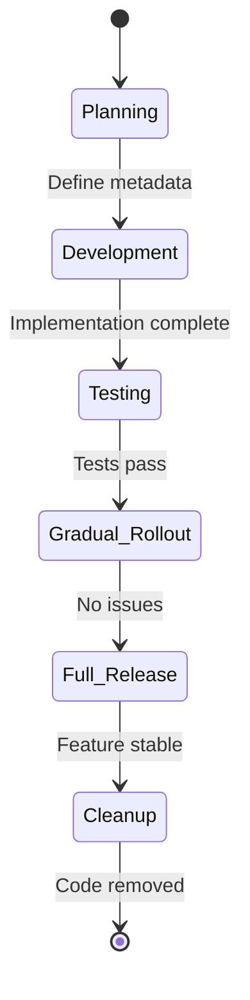
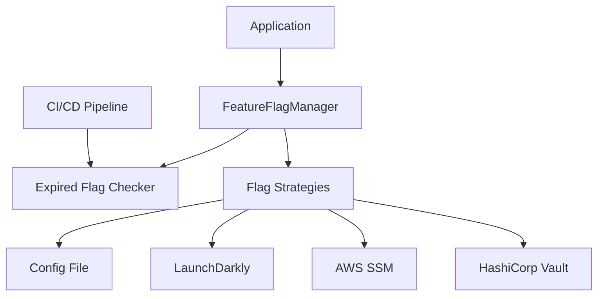

# Standardizing Feature Flags: From Chaos to Control

A Guide to Implementing Short-Lived, Maintainable Feature Flags

## Introduction

Modern CI/CD pipelines and single-branch development practices enable rapid deployment, but they often leave teams grappling with hidden technical debt. Feature flags, while powerful, can become a liability when mismanaged. If your team struggles with never-cleaned-up flags, nested conditional complexity, and uncertainty about when/if to remove flags, this article proposes a systematic solution to transform feature flags from a liability into a maintainable asset.

<!--truncate-->

## The Problem: Feature Flags Gone Rogue

### 1. The "Forever Flag" Dilemma
Flags created for short-term experiments or releases linger indefinitely, cluttering codebases and complicating logic.

### 2. Nested Complexity
Deeply nested flags (e.g., `if flagA && (flagB || flagC)`) lead to unpredictable behaviors, making debugging a nightmare.

### 3. Lack of Ownership
No process exists to track expiration, leading to fear of removing flags ("What if it breaks something?").

### 4. Inconsistent Configuration
Flags are scattered across config files, SaaS tools, or environment variables with no unified interface.

## The Solution: Short-Lived Flags with Metadata & Centralized Governance

To solve this, we propose:

1. Feature Flags as First-Class Citizens with structured metadata
2. A Feature Flag Manager as the single source of truth
3. Automated Expiration & Cleanup integrated into CI/CD

## Lifecycle Management

Feature flags should follow a well-defined lifecycle to ensure they don't become technical debt. Here's the recommended lifecycle:



### 1. Planning Phase
- Define flag purpose and scope
- Assign ownership and expiry date
- Document dependencies and rollback plan
- Create JIRA/ticket linkage

### 2. Development Phase
- Implement feature behind flag
- Add monitoring and metrics
- Document usage patterns

### 3. Testing Phase
- Verify both flag states (on/off)
- Test rollback procedures
- Validate monitoring

### 4. Gradual Rollout
- Start with internal users
- Expand to beta users
- Monitor metrics and errors
- Ready rollback plan

### 5. Full Release
- 100% user base exposure
- Final verification period
- Prepare for cleanup

### 6. Cleanup
- Mark flag for removal
- Remove flag-dependent code
- Update documentation

## Architecture: Standardizing Flags with Metadata

### 1. Feature Flag Structure
A flag is more than a name and boolean—it's a structured entity:

```typescript
interface FeatureFlag {
  // Basic Information
  name: string;          // Unique identifier (e.g., "checkout-redesign")
  description: string;   // Purpose and overview
  status: "active" | "expired" | "deprecated"; // Current state
  
  // Ownership & Timing
  owner: {
    team: string;        // Responsible team
    contact: string;     // Primary contact (email/slack)
  };
  createdAt: Date;      // Creation timestamp
  expiryDate: Date;     // Hard expiration date
  
  // Configuration
  defaultValue: boolean; // Fallback if no value is found
  rolloutPercentage: number; // For gradual rollout
  
  // Dependencies & Integration
  dependencies: {
    services: string[];  // Dependent services
    flags: string[];     // Other dependent flags
    apis: string[];      // External API dependencies
    versions: {          // Required versions
      [service: string]: string;
    };
  };
  
  // Rollback Plan
  rollback: {
    steps: string[];     // Rollback procedure
    verificationSteps: string[]; // Verification steps
    alerts: {            // Monitoring alerts
      metric: string;
      threshold: number;
    }[];
  };
  
  // Metadata
  jiraTicket?: string;   // Related JIRA ticket
  prUrl?: string;        // Implementation PR
  metrics: {             // Monitoring metrics
    name: string;
    description: string;
    dashboard?: string;  // Grafana/DataDog dashboard
  }[];
}
```

### 2. Feature Flag Manager
A centralized service to manage flags across sources (files, LaunchDarkly, Vault, etc.):

```typescript
interface FeatureFlagManager {
  getFlag(name: string): boolean;       // Evaluates flag status
  getExpiredFlags(): FeatureFlag[];     // Flags past expiryDate
  addStrategy(source: FlagStrategy);    // Plug-in for config sources
}

interface FlagStrategy {
  fetchFlag(name: string): boolean | null;
}
```

### 3. System Diagram



## Implementation Guidelines

### Step 1: Define Flags with Metadata

```yaml
# features/flags.yaml
- name: "checkout-redesign"
  description: "New checkout UI. Owner: Team A. JIRA: PROJ-123"
  expiryDate: 2024-12-31
  defaultValue: false
```

### Step 2: Build the Feature Flag Manager

```typescript
class DefaultFeatureFlagManager implements FeatureFlagManager {
  private strategies: FlagStrategy[] = [];
  
  addStrategy(strategy: FlagStrategy) {
    this.strategies.push(strategy);
  }

  getFlag(name: string): boolean {
    const flag = this.getFlagMetadata(name); // Fetch from metadata store
    if (flag.status === "expired") {
      this.notifyExpired(flag); // Alert owners/Slack
      return flag.defaultValue;
    }
    
    // Evaluate strategies in priority order
    for (const strategy of this.strategies) {
      const value = strategy.fetchFlag(name);
      if (value !== null) return value;
    }
    return flag.defaultValue;
  }
}
```

### Step 3: Integrate with CI/CD

#### Pre-Commit Hook:
- Reject flags without expiryDate or description.

#### CI Pipeline Step:

```bash
# Check for expired flags
manager.getExpiredFlags().forEach(flag => {
  failPipeline("Expired flag detected: ${flag.name}");
});
```

#### CD Cleanup Automation:
- Auto-disable expired flags in production
- Open PRs to remove expired flag code

#### Monitoring:
- Dashboard tracking flag age, expiration timeline, and ownership

## Cultural Shift: From Ad Hoc to Accountable

1. **Ownership**: Assign a flag owner (team/individual) responsible for cleanup
2. **Documentation**: Link flags to tickets/epics for traceability
3. **Audits**: Quarterly reviews to delete obsolete flags

## Conclusion

By treating feature flags as short-lived entities with explicit ownership and expiration, teams reduce complexity and regain confidence in their codebase. The proposed Feature Flag Manager and CI/CD integration create a safety net for sustainable experimentation.

Start small: Implement this for one flagship feature, measure the reduction in legacy flags, and scale iteratively.

## Next Steps

1. Review your current feature flags inventory
2. Implement the Feature Flag Manager
3. Set up automated cleanup processes
4. Establish regular flag reviews
5. Monitor and measure improvements

